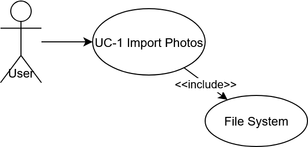
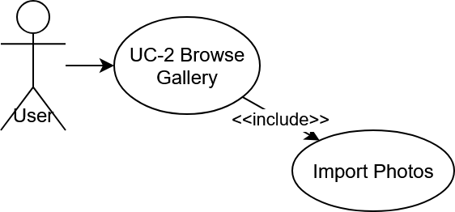
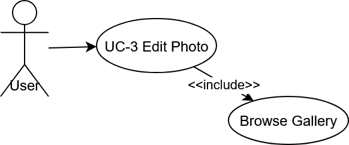

# SRS — Software Requirements Specification
**Project:** Photo Manager Application  
**Author:** Júlia Ondrušová  
**Date:** October, 10, 2025

---

## 1. Introduction and Purpose
The goal is to create a simple and fast photo management application for Windows. It will allow users to browse, sort, search, and perform basic edits on their photos.

It addresses the problem of disorganized photo storage in various formats (e.g., from phone or camera) and enables efficient organization and export.

The users will be general people and photography enthusiasts who want to manage their photo albums on a computer without complex software.

---

## 2. Scope of the System
The system will cover:
- Importing photos from folders and external drives.
- Adding tags, comments, and ratings to individual photos.
- Searching by date, tag, and color.
- Basic edits (crop, rotate, brightness, contrast, saturation).
- Exporting photos to different formats (.jpg, .png, .HEIC).
- Adding watermarks.
- Bulk and individual processing.

Out of scope:
- Automatic categorization using AI.
- Mobile version of the application.
- Cloud backup of photos.

---

## 3. Functional Requirements

### 3.1 Photo Management
- FR-1.1: The user can import photos from a folder or external drive.  
- FR-1.2: The system displays photos in a gallery or list view.  
- FR-1.3: The user can add tags, comments, and ratings to photos.  
- FR-1.4: The user can filter or search photos by date, tag, and color.  
- FR-1.5: The user can sort photos by rating, date, or name.  

### 3.2 Photo Editing
- FR-2.1: The user can crop, rotate, and adjust brightness, contrast, and saturation.  
- FR-2.2: The user can add a watermark.  
- FR-2.3: The user can process multiple photos at once (bulk processing).  

### 3.3 Import and Export
- FR-3.3: The user can import photos from various devices.  
- FR-3.4: The user can export photos to other formats (.jpg, .png, .HEIC).  
- FR-3.5: The user can select the target folder for export.  

---

## 4. Non-Functional Requirements (NFR)

| Category | ID | Description |
|-----------|----|-------------|
| **Performance** | NFR-1 | Load 10,000 photos within 5 seconds after opening the catalog. |
| **Reliability** | NFR-2 | Application autosaves the last opened folder and user session.  |
| **Usability** | NFR-3 | Basic edit operation can be performed in max. 3 clicks. |
| **Portability** | NFR-4 | Works on Windows. |
| **Security** | NFR-5 | Local data are stored privately and never shared. |
| **Memory Usage** | NFR-6 | The application must have low memory usage (not burden the system). |

---

## 5. Actors and Use-Cases

### 5.1 Actors
| Actor | Description |
|--------|--------------|
| **User** | Works with the app — imports, browses, edits, and exports photos. |
| **File System** | Source or destination for imported/exported files. |

### 5.2 Use-Cases

| ID | Name | Description |
|----|------|--------------|
| UC-1 | Import Photos | The user selects a folder and the app loads all photos. |
| UC-2 | Browse Gallery | The user views photos in the gallery. |
| UC-3 | Edit Photo | The user edits a photo (crop, filter, brightness). |
| UC-4 | Add Tags and Comments | The user adds information to photos. |
| UC-5 | Search Photos | The user searches photos by tag, color, or date. |
| UC-6 | Export Photos | The user exports selected photos to another format. |
| UC-7 | Bulk Processing | The user applies edits to multiple photos at once. |

### 5.3 Use-Case Diagram

---

## 6. System Constraints

- SC-1: Programming language and framework: C++ / Qt.  
- SC-2: Use only open-source libraries (open-source version of Qt).   
- SC-3: Works fully offline.  
- SC-4: Maximum file size: 10 MB per photo.  
- SC-5: The application works exclusively on Windows systems.  
- SC-6: A progress bar must be present during processing (to indicate the program is responding).  

---

## 7. Assumptions and Dependencies

- A-1: The user has at least 8 GB RAM.  
- A-2: The application has access to the file system (disk, USB).  
- A-3: The user has a Windows device.  
- A-4:
- ...

---

## 8. Out of Scope
- Categorization using AI.  
- Mobile version of the application.  
- Cloud backup of photos.  

---

## 9. Open Questions

- Q1: Should edits overwrite the original file or save a copy?  
- Q2: Which export formats are mandatory?  
- Q3: How exactly should bulk processing work (sequentially or in parallel)?  

